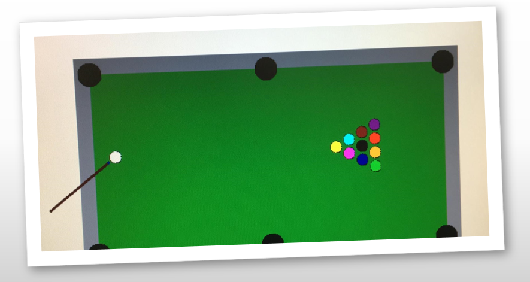

# Billiard 

School project in course 044160 at the Technion, Israel. The project was written in systemverilog for the DE10-Standard FPGA.
The game is a variation of the well known billiard game. This version is single player, and the goal is to score all the balls with a limited number of hits.

short demonstration : https://youtu.be/Qr8_kIYxQ48

